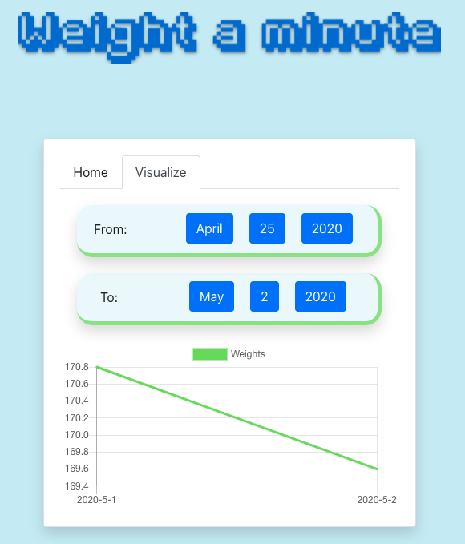

# Weight a minute...




## What is this?

I plan on using this application to make a habit of tracking my weight everyday, since one of my #QuarantineGoals is to cut the weight I've gained over the last few weeks of the Spring 2020 semester.

## Goals

* **Simple**: It should only support the following features **initially**: logging weight on a date, viewing weight on a date, updating weight on a date, and viewing to-be-determined aggregations on weights over a range of dates (maybe some data viz here).
* **Extensible**: In case I end up wanting to add more features in the future.
* **Aesthetic**: Should be pretty enough to use as a browser homepage.

## Run an instance locally

### Pre-requisities

* Node/npm (I have versions 13.12.0 / 6.14.4))
* Docker (I have version 19.03.8)

### Edit config files

`api/.env`:
```
PORT=5601 (port the backend is running on)
DB_PATH=db.local (name of the sqlite3 db, will be created in api/data)
```

`frontend/.env`:
```
REACT_APP_API_HOST=localhost (host api is running on)
REACT_APP_API_PORT=5601 (port api is running on)
```

Whatever port is used for `PORT`/`REACT_APP_API_HOST` must also be used in two places: the `EXPOSE ${PORT}` directive in `api/Dockerfile` and `services:api:ports` in `docker-compose.yml`.

Additionally, the port the frontend runs on can be changed by adding a flag to the `CMD` directive in `frontend/Dockerfile`, e.g. `CMD ["serve", "-s", "build", "-l", "3000]`. By default, it'll
run on port 5000, which is reflected in `docker-compose.yml`, so if changed, that'll need to be updated to at `services:frontend:ports`.

### Run it

```
$ git clone git@github.com:werdrew/weight-a-minute.git
$ cd weight-a-minute
$ ./build
$ docker-compose up -d
```

`./build` will build the Docker images for the frontend and backend. `docker-compuse up -d` will start the application. Access the site at `localhost:5000`, or whatever port the frontend is running on.

`./build -f` will force the Docker images to be rebuilt if any changes are made to the codebase.

`api/data` is a persistent volume, so that the db doesn't get overwritten between image builds.

### Using make

make should come pre-installed on most systems I think.

Build and run initially:
```
$ make build
$ make run
```

Rebuild after making changes:
```
$ make rebuild
```

Shut er down:
```
$ make kill
```

### Set as your browser homepage?

[If you're using Chrome...](https://kb.nmsu.edu/page.php?id=72731)

[If you're using Firefox...](https://www.businessinsider.com/how-to-change-homepage-on-firefox)

## Known TODOs

* More aggregations, finer tuning in visualize tab, more data viz?
* Write tests, actually use ci!!, stop pushing directly to master :p